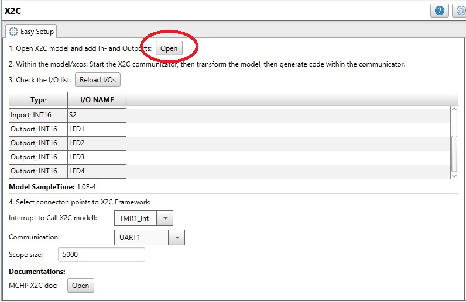
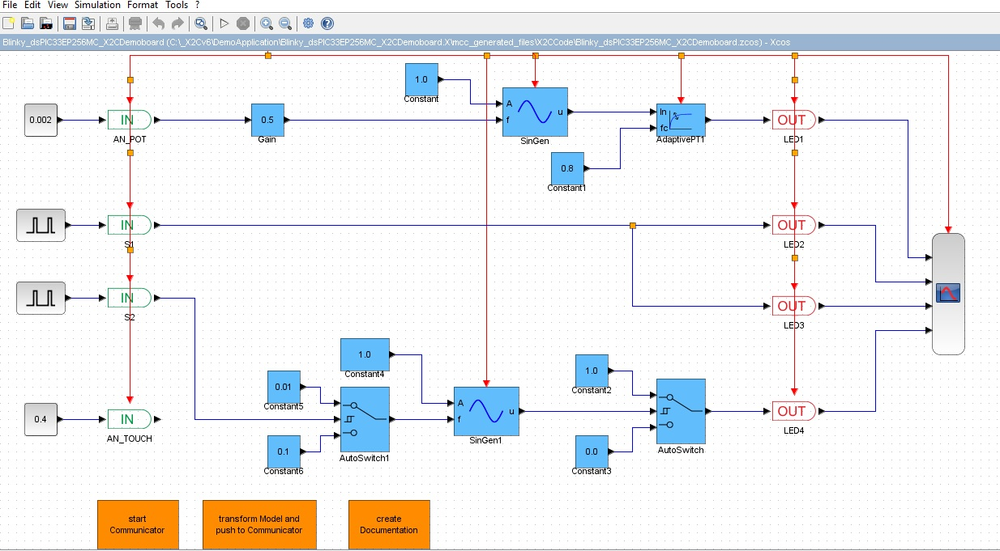
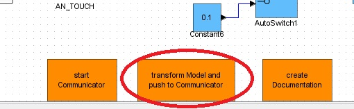
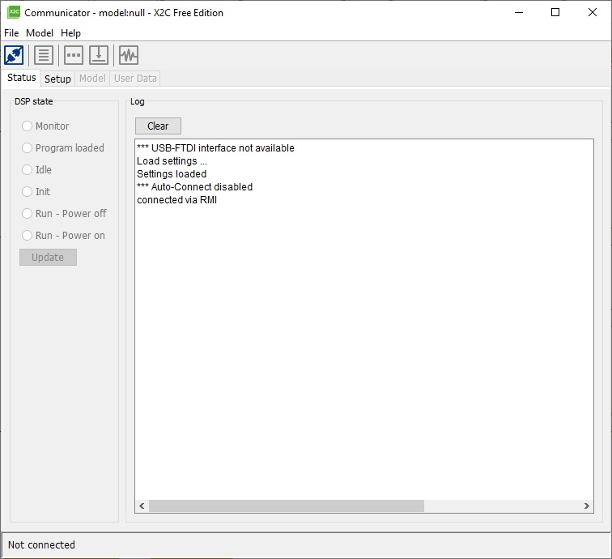
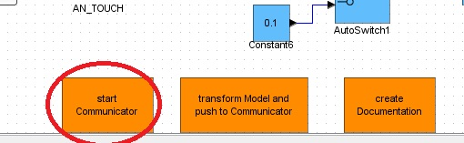
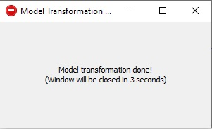
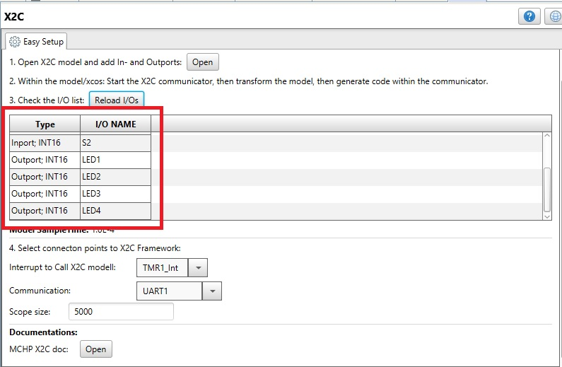
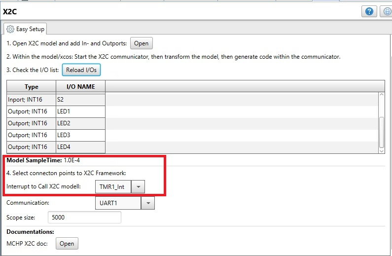
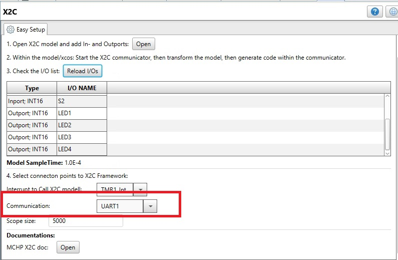
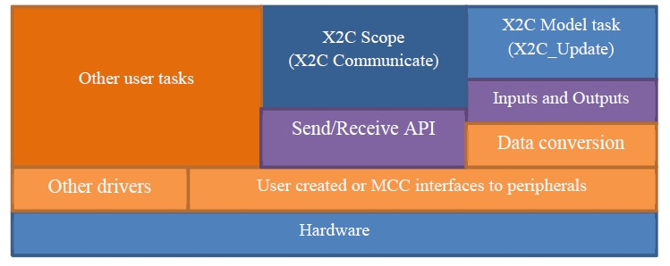

# mc_foc_sl_fip_dspic33ck_mclv2

MPLABX Project: mc_foc_sl_fip_dspic33ck_mclv2

## Getting Started

The X2C MCC library purpose is to help to create an X2C based project structure. The module
creates the necessary framework files and model files.
The project and the code is generated by MPLAB X MCC and X2C (Scilab model).
* Use MPLABX to open the project.
* Use MCC plugin to configure the peripherals.
* Use Scilab and X2C to modify the model and generate code.
* Use X2C communicator to modify parameters and monitor signals during runtime.

### Prerequisites

* **MPLABX IDE** : Development Environment. 
* **MCC** : Microchip Code Configurator. Microchips code configuration tool(MPLABX Plugin)
* **XC Compiler** : Microchip Compilers.
* **Scilab/XCOS** : Scilab(Scientific Laboratory) is free and open source software for numerical computation providing a powerful computing environment for 
  engineering and scientific applications.
* **X2C**: Code generation add-on for SCILAB, that allows the generate C-code of the model including a real-time online debugging interface for monitoring 
  and modifying model signal.

### Software
* [MPLAB X v5.40](https://www.microchip.com/mplab/mplab-x-ide)
* [XC Compilers](https://www.microchip.com/mplab/compilers)
* [Scilab v5.5.2](https://www.scilab.org/download/5.5.2) (Scilab 6.x is not supported yet)
* [X2C v6](https://x2c.lcm.at/downloads/)

Model sample rate: 1.0E-4

### Built With

* [XC16](https://www.microchip.com/mplab/compilers) - Microchip C compiler for 16bit micros
* [X2C](https://x2c.lcm.at/) - Generate C code from Scilab/XCOS


### Hardware

Optional[dsPIC33CK256MP508]


## Hardware settings

Users have to do the Hardware Settings as per their project/model requirements.  

## Peripheral Connections: 
   **Interrupt to call X2C Model** : This is a UI component in the X2C MCC UI. User has options to select different 
   peripherals(Timer,PWM,ADC) as the Interrupt source to call the X2C Model. Based on the model sample time 
   users have to configure the interrupt rate to match the model sample time.
   
   For Example: If the Model sample rate is set as 10KHz(100 Micro Seconds)  and Timer1 is selcted to execute the model
   (Interrupt to call X2C Model), then Timer1 needs to be configured    to have a period of 100 Micro Seconds(Interrupt 
   is generated every 100 Micro Seconds).(Note: Any interrupt which can produce constant timing can be used.)

   If the user has requirement for any other peripheral based on the model , they have to add the peripheral to the Project 
   and configure them.

## UART settings: 

   **Communication**: For X2C Scope Communication currently UART is used. User needs to select the required UART instance 
   and Configure the UART.

## Running the tests

Open the project in MPLABX, then program the device.

## Detailed Information:

## X2C MCC Library Configuration:

## 1. Open the model:
The open button first copies the model file to the project/mcc_generated/X2CCode folder. Then starts
the Scilab and opens the project.xcos file. The XCOS model getâ??s the same name as the MPLAB X
project.

<p align="center">
   
</p>

Add Inputs and Outputs to the model what is necessary for your project. You can add inputs and
outputs later at the model development phase too.

<p align="center">
   
</p>


Use the palette browser (View->Palette browser). The IN and OUT blocks can be found in the
X2C/General palette. Or just copy the existing I/O blocks. Connections are necessary at the inputs of
the blocks otherwise the code generation will fail. (The outputs of the blocks do not require
connections.)

## 2. Transform the model and generate code from the transformed model (xml):
The model file contains the following yellow boxes. If these blocks are missing, please add them from
palette browser X2C/General palette.

<p align="center">
   
</p>

Double click on the start communicator and wait until the following X2C communicator window
appears:

<p align="center">
   
</p>

Next step, go back to the model (without close the X2C Communicator) and double click to the
transform Model and push to the communicator

<p align="center">
   
</p>

Now the following outputs should appear in the communicator.

<p align="center">
   
</p>

**Make sure the model name is stated in the first line of the communicator.**

## 3. Connect IO with the peripherals:
The Scilab/Xcos software and the X2C communicator window can be closed.

This feature is not working automatically yet. The goal is to connect the peripheral interface functions with the
model In- and Outport blocks at the table. The user has to connect these interfaces manually as
described later.

Nevertheless, the X2C library can load the modelâ??s I/O list and generates some helping comments.
Push the Reload I/O button and the generated model xml description will be parsed and the I/Os of the
modell will be listed in the table.

<p align="center">
   
</p>

## 4. Select X2C calculation and communication connection points:

* First select where to call the model calculation function. Make sure the selected peripheral interrupt is configured! \
If you select manual, then do not forget to call X2C_MainUpdate() to run the model calculation! NOTE: The Model sample time
has to be equal with the X2C_MainUpdate() function calling period, namely the selected interrupt period.

<p align="center">
   
</p>

* Then select the X2C_Scope communication interface. UART1 and UART2 supported at the moment. Make sure again the selected
peripheral is configured fine! The X2C_Communicate(); function must be called periodically in the main loop! Do not forget to call it manually!

<p align="center">
   
</p>

* With Scope size you can select the size of the buffer array that stores the information for the
graphs.

## 4. Generate Source Code using MCC:

If the peripheral and X2C module configurations are ready just click the generate button at the right top corner. The whole files and project 
structure generated automatically. However, there are left a few steps that need to be manually done.

## 5. Manual TODO list after code generation: 

The project structure is ready in the MPLAB X.To be able to use the generated code, the controller needs a typical configuration layer. These low 
level peripheral functions provided by Microchip (MCC, Harmony or user made), but the user have to take care to connect them to the X2C model.

<p align="center">
   
</p>

**The generated project structure**

Here is a short explanation of the generated files:

â?¢ **mcc_generated_files\X2CCode\X2C.c:**
 This is generated from the xcos model, do not modify it manually.

â?¢ **mcc_generated_files\X2CCode\X2CMain.c:** 
Contains the model update function call to
calculate the module. Contains the Input and Output update functions that need to be
manually modified.

â?¢ **mcc_generated_files\X2CCode\X2CUtils.c:** 
Contains the X2C core and X2C Scope
initialization. These functions are called in the mccâ??s SYSTEM_Initialize(void) method.

â?¢ **mcc_generated_files\X2CCode\X2CComm.c:**
This file is responsible to connect the LNet
protocol and the hardware communication layer (e.g. Uart interfaces).

**The following steps have to be manually done in the MPLAB X IDE. MCC does not yet support some necessary functions to automate these steps.**

**1. X2C_Communicate() function:**

The X2C_Communicate() function into the main loop. The function sends and receives the data
through the LNet protocol. This task must run parallel to the X2C_Update function.
The X2C_Update function, the connection of the peripherals and the model IOs will be explained in
the next steps.

**2. Modify the X2CMain.c:**

+ **Connect the inputs of the module:**

X2CMain.c contains UpdateInports(void). Find the function definition, the comment section should contain a list of the available Input variables 
connected to the model. These variables must be manually updated. Here is an example, PORTA1 bit is read and converted to INT16 representation.

```
if (PORTA & 1) {
Inports.Inport = INT16_MAX;
}else {
Inports.Inport = 0;
}
```

+ **Connect outputs of the module:**

The model output variables are calculated every time, after the X2C_Update() function is called. The variables must read out manually, and the 
scaled value passed to the hardware peripheral interfaces.

```
if (*Outports.pOutport) { // if model Outport different than zero
LATB |= 1; // set LATB0
} else {
LATB &= ~1; // clear LATB0
}
```

## 5. Run the code on the hardware: 

Everything is ready to build the project and try it on the hardware. Just make and program the device as usually done in other projects. 
Users have the option to program through batch script as well.
